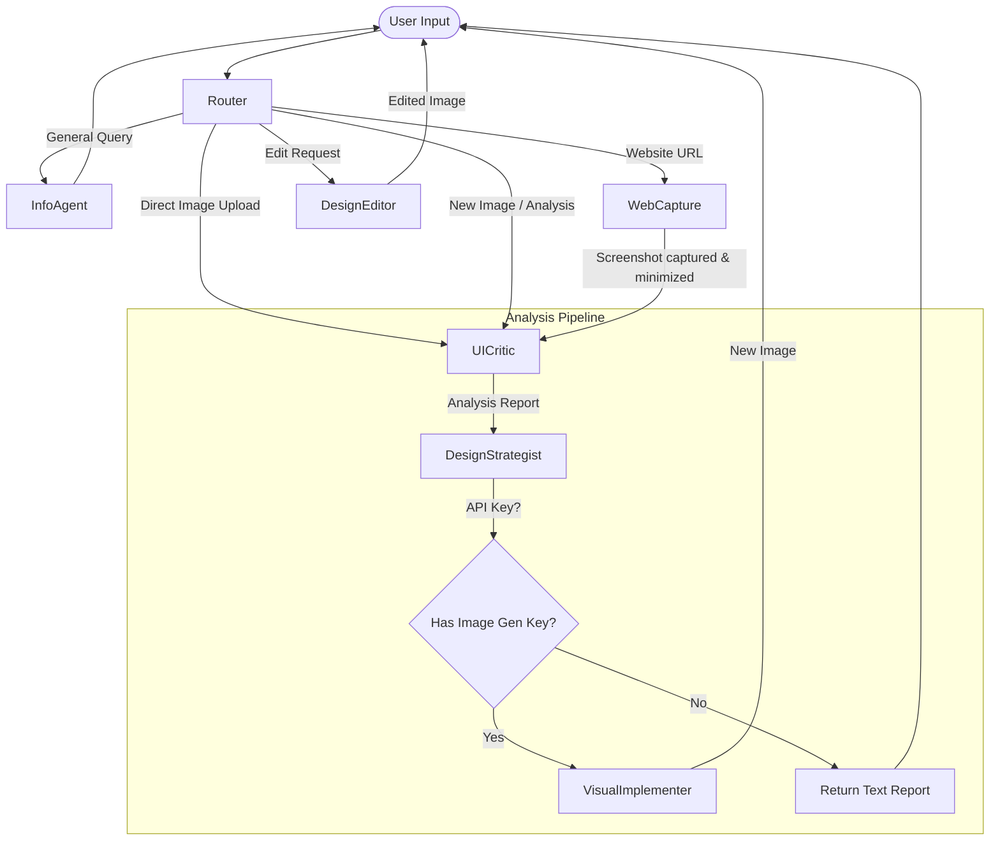

# UI/UX Feedback Agent Team (UI Analyser)

A sophisticated multi-agent system built with **LangGraph**, **LiteLLM**, and **Pydantic** that analyzes landing page designs, provides expert UI/UX feedback, and optionally generates improved versions using advanced multimodal models.

## Features

- **🌐 Website URL Support**: Simply provide a website URL, and the agent uses Playwright to capture a full-page screenshot for analysis.
- **🖼️ Direct Image Upload Support**: Drag-and-drop or select mockup image files (`png`, `jpg`, `jpeg`) to perform immediate UI/UX analysis on your wireframes or offline designs, completely bypassing Playwright screenshot capture.
- **👁️ Visual AI Analysis**: Agents automatically analyze layout, typography, colors, and UX patterns from screenshots.
- **🎯 Expert Feedback**: Comprehensive critique covering visual hierarchy, accessibility, conversion optimization, and design best practices.
- **✨ Automatic Improvements**: Generates improved landing page designs incorporating all recommendations (requires cloud API key).
- **🤖 Multi-Agent Orchestration**: Built on LangGraph with explicit routing, state management, and clear multi-agent pipelines.
- **🔌 Hybrid Model Support**: Run entirely locally with Ollama, or use cloud APIs (Gemini, OpenAI, Anthropic). The system intelligently splits workloads between a fast text model and a vision model.
- **💾 Memory Persistence**: Uses SQLite checkpointing for maintaining conversation and design history across sessions.
- **📊 Comprehensive Logging**: Every node logs its actions with clear visual markers, and the final state is captured to print a detailed, end-to-end transcript of all accumulated messages when the graph reaches the `END` state.
- **🖼️ Built-in Image Minimization**: Direct image uploads and web screenshots are run immediately through an `image_optimizer` utility. It downscales the longest side to `settings.MAX_IMAGE_DIMENSION` (default 1280px), flattens transparency/alpha channels onto a solid white background, and saves it in a highly optimized JPEG format, saving network payloads and accelerating vision LLM processing.
- **🗑️ Sleek Sidebar Session Reset**: Includes a one-click session-clearing button in the sidebar that wipes conversation states and refreshes the thread ID, allowing you to run new audits instantly.

## Architecture



The system uses a **StateGraph (Supervisor/Worker pattern)** with specialized agents:

1. **Router Agent (Supervisor)**: Determines if the request requires URL capturing, direct image analysis, design editing, or is a general query. If a picture/mockup has been uploaded, it automatically skips website capture and routes straight to the critique node. Uses the fast text model.
2. **Info Agent**: Handles general Q&A about UI/UX design. Uses the text model.
3. **Capture Website Node**: Uses Playwright to screenshot provided URLs, and automatically runs them through the image optimizer. Handles preloader detection and scroll-driven animations.
4. **Analysis Pipeline (Sequential Subgraph)**:
   - **UI Critic**: Analyzes design layout, hierarchy, and UX. Uses the **vision model** (the only node that requires it). Screenshots are automatically downscaled before analysis.
   - **Design Strategist**: Creates a detailed, actionable improvement plan with structured output. Uses the text model.
   - **Visual Implementer** *(conditional)*: Generates the improved landing page design. Requires a cloud API key (Gemini/OpenAI). If no key is configured, the pipeline gracefully stops at the strategist and returns the text-based report.
5. **Design Editor**: Edits existing generated designs based on iterative feedback.

### Model Selection Strategy

The system uses **two separate models** to optimize speed and resource usage:

| Model Role | Default (Local) | Used By |
|---|---|---|
| **Text Model** | `ollama/llama3.2:latest` (~2 GB) | Router, Info Agent, Strategist, Design Editor |
| **Vision Model** | `ollama/llama3.2-vision:latest` (~7.8 GB) | UI Critic (screenshot analysis) |

The `call_llm()` function automatically selects the right model: **vision model** when an image is provided, **text model** otherwise. This avoids loading the heavy vision model for simple text tasks, dramatically improving response times.

## Quick Start

### 1. Prerequisites
- Python 3.12+
- [Ollama](https://ollama.ai/) installed and running (for local mode)

### 2. Setup
```bash
# Clone or navigate to the directory
cd ui_analyser

# Create and activate a virtual environment
python -m venv venv
source venv/bin/activate  # macOS/Linux

# Install dependencies
pip install -r requirements.txt

# Install Playwright browsers (for website capturing)
playwright install chromium
```

### 3. Pull Ollama Models
```bash
# Required: Vision model for screenshot analysis
ollama pull llama3.2-vision:latest

# Recommended: Lighter text model for faster routing & strategy
ollama pull llama3.2:latest
```

### 4. Configuration (Optional)
For image generation and cloud model access, create a `.env` file in the project root:
```env
GEMINI_API_KEY="your_gemini_api_key_here"
# Optional:
# OPENAI_API_KEY="your_openai_key"
# ANTHROPIC_API_KEY="your_anthropic_key"

# Optional tuning (defaults shown):
# LLM_TIMEOUT_SECONDS=900
# MAX_IMAGE_DIMENSION=1280
```

> **Note**: Without a cloud API key, the pipeline will still run the full analysis and strategy — only the visual redesign generation step is skipped.

### 5. Run the Streamlit Interface
```bash 
*using uv*
-------------
uv sync 
source .venv/bin/activate 
streamlit run app.py

*using venv*
-------------
python -m venv .venv
source .venv/bin/activate 
pip install -r requirements.txt
streamlit run app.py
```

## Project Structure

```
ui_analyser/
├── app.py                          # Streamlit UI entry point
├── requirements.txt                # Python dependencies
├── pyproject.toml                  # Project metadata & dependency pins
├── .env                            # API keys (not committed)
├── data/                           # SQLite checkpoints (auto-created)
├── artifacts/                      # Generated screenshots & designs
└── src/
    ├── agents/
    │   └── nodes.py                # All LangGraph node functions
    ├── config/
    │   └── settings.py             # Pydantic settings (models, keys, toggles)
    ├── models/
    │   └── llm_client.py           # Unified LLM caller (auto text/vision routing, image downscaling)
    ├── prompts/
    │   └── templates.py            # System prompts for each agent
    ├── state/
    │   └── schema.py               # GraphState + Pydantic structured outputs
    ├── tools/
    │   ├── web_capture.py          # Playwright screenshot tool (preloader & scroll handling)
    │   └── image_generation.py     # Image generation (Gemini native + LiteLLM fallback)
    ├── utils/
    │   ├── system_checks.py        # Ollama detection & model listing
    │   └── image_optimizer.py      # Resizes, handles transparency, and compresses images (JPEG)
    └── workflows/
        └── graph.py                # LangGraph workflow definition & edges
```

## Configuration Reference

All settings live in `src/config/settings.py` and can be overridden via environment variables or a `.env` file:

| Setting | Default | Description |
|---|---|---|
| `USE_CLOUD` | `False` | Use cloud APIs instead of local Ollama |
| `CLOUD_PROVIDER` | `Gemini` | Cloud provider: `Gemini`, `OpenAI`, or `Anthropic` |
| `VISION_MODEL` | `ollama/llama3.2-vision:latest` | Local vision model |
| `TEXT_MODEL` | `ollama/llama3.2:latest` | Local text model |
| `CLOUD_VISION_MODEL` | `gemini/gemini-2.5-flash` | Cloud vision model |
| `CLOUD_TEXT_MODEL` | `gemini/gemini-2.5-flash` | Cloud text model |
| `LLM_TIMEOUT_SECONDS` | `900` | Timeout for LLM calls (seconds) |
| `MAX_IMAGE_DIMENSION` | `1280` | Max pixel dimension for screenshots sent to the LLM |
| `PLAYWRIGHT_TIMEOUT_MS` | `60000` | Navigation timeout for Playwright (ms) |

## Sidebar Controls

The Streamlit sidebar provides runtime model configuration:

- **Cloud vs Local toggle**: Switch between Ollama and cloud APIs
- **Vision Model selector**: Choose which vision-capable model analyzes screenshots
- **Text Model selector**: Choose a lighter model for routing, strategy, and prompt tasks
- **Cloud Provider & API Key**: Configure Gemini, OpenAI, or Anthropic when using cloud mode

## Extending the System

- **Prompts**: Edit `src/prompts/templates.py` to change agent behavior.
- **State**: Add new tracking variables in `src/state/schema.py`.
- **Workflows**: Modify `src/workflows/graph.py` to add new agents or change the routing logic.
- **Models**: Update `src/config/settings.py` to add new model providers or change defaults.
- **Tools**: Add new tools in `src/tools/` and wire them into node functions in `src/agents/nodes.py`.

## License

This project is licensed under the Apache License 2.0. See the [LICENSE](LICENSE) file for details.

## Author

Created and maintained by [gedeoni](https://github.com/gedeoni).
