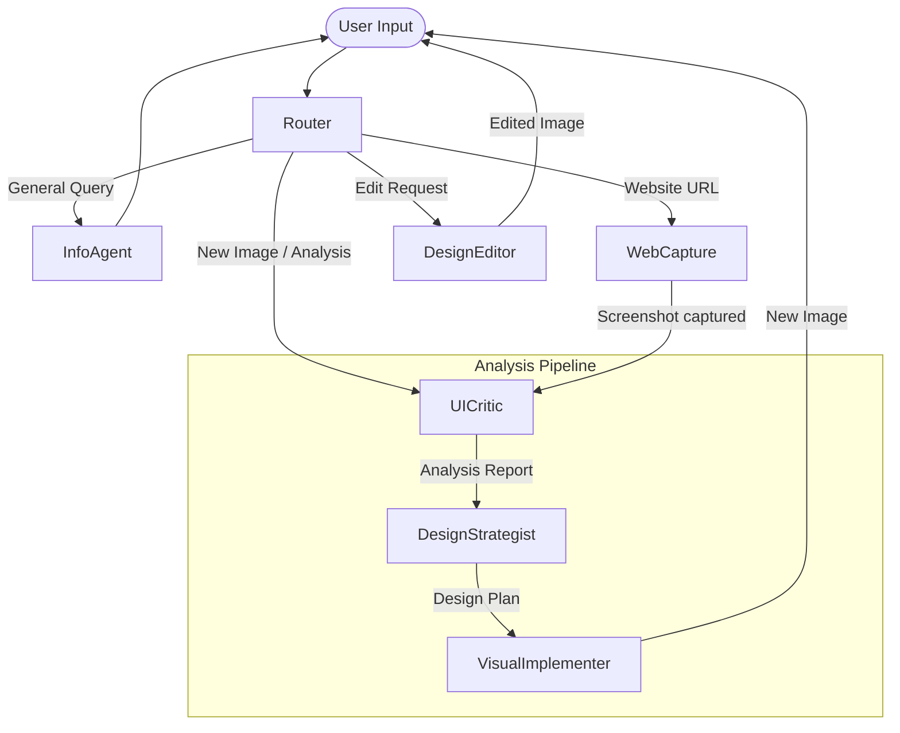

# UI/UX Feedback Agent Team (UI Analyser)

A sophisticated multi-agent system built with LangGraph, LiteLLM, and Pydantic that analyzes landing page designs, provides expert UI/UX feedback, and automatically generates improved versions using advanced multimodal models.

## Features

- **🌐 Website URL Support**: Simply provide a website URL, and the agent uses Playwright to capture a full-page screenshot for analysis.
- **👁️ Visual AI Analysis**: Agents automatically analyze layout, typography, colors, and UX patterns from screenshots.
- **🎯 Expert Feedback**: Comprehensive critique covering visual hierarchy, accessibility, conversion optimization, and design best practices.
- **✨ Automatic Improvements**: Generates improved landing page designs incorporating all recommendations.
- **🤖 Multi-Agent Orchestration**: Built on LangGraph with explicit routing, state management, and clear multi-agent pipelines.
- **🔌 Model Agnostic**: Powered by LiteLLM, allowing you to easily swap between Gemini, OpenAI, Claude, or local Ollama models.
- **💾 Memory Persistence**: Uses SQLite checkpointing for maintaining conversation and design history across sessions.

## Architecture



The system uses a **StateGraph (Supervisor/Worker pattern)** with specialized agents:

1. **Router Agent (Supervisor)**: Determines if the request requires URL capturing, image analysis, design editing, or is a general query.
2. **Info Agent**: Handles general Q&A.
3. **Capture Website Node**: Uses Playwright to screenshot provided URLs.
4. **Analysis Pipeline (Sequential Subgraph)**:
   - **UI Critic**: Analyzes design layout, hierarchy, and UX.
   - **Design Strategist**: Creates a detailed, actionable improvement plan.
   - **Visual Implementer**: Generates the improved landing page design.
5. **Design Editor**: Edits existing generated designs based on iterative feedback.

## Quick Start

### 1. Prerequisites
- Python 3.12+
- `uv` (Fast Python package installer)

### 2. Setup
```bash
# Clone or navigate to the directory
cd ui_analyser

# Initialize the project environment
uv sync

# Install Playwright browsers (for website capturing)
uv run playwright install chromium
```

### 3. Configuration
Copy the sample environment file or configure your environment directly:
```bash
cp .env.example .env
```
Add your API keys to `.env`:
```env
GEMINI_API_KEY="your_gemini_api_key_here"
# Optional: OPENAI_API_KEY="your_openai_key"
```

### 4. Run the Streamlit Interface
```bash
uv run streamlit run app.py
```

## Extending the System

- **Prompts**: Edit `src/prompts/templates.py` to change agent behavior.
- **State**: Add new tracking variables in `src/state/schema.py`.
- **Workflows**: Modify `src/workflows/graph.py` to add new agents or change the routing logic.
